# Trowel & Error

An unofficial spiritual successor to Torojima's *Buildhelper* wands, rebuilt from scratch for **Minecraft 1.21.11 (Forge)**.

A full set of builder's tools reimagined as colorful trowels, ladles, hoses, and a mop — plus an Undo system.

---

## Features

- **Gap Fill / Random Gap Fill Trowel** – Fill empty space with a block (or random variants)
- **Fill Down / Random Fill Down Trowel** – Create support columns that fill downward
- **Exchange / Random Exchange Trowel** – Replace one block type with another across a region
- **Cube Digger Trowel** – Configurable shape (Square / Circle / Diamond), depth, and ore-sparing
- **Copy-Paste Trowel** – Copy a build and paste it with rotation + live preview
- **Air Trowel** – Quickly clear large areas
- **Fire Trowel** – Combat + utility tool
- **Undo Trowel** – Reverses the last action (up to 10 actions stored per world)
- **Water / Lava Fill Ladle** – Region-based fluid filling
- **Drain Ladle** – Removes water and lava from a selected region
- **Sponge Mop** – Instantly clears a large volume of fluid (great for ocean monuments)
- **Water / Lava Hose** – Sprays a line of fluid in the direction you’re looking (sneak for flowing fluid)

All block-modifying tools support the **Undo Trowel**.

---

## Crafting Recipes

> All recipes are unlocked in the recipe book when you obtain the key ingredient.

### Basic Trowels

| Tool | Recipe |
|------|--------|
| Air Trowel | 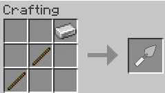 |
| Gap Fill Trowel | 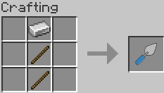 |
| Fill Down Trowel | 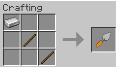 |
| Exchange Trowel | 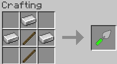 |
| Cube Digger Trowel | 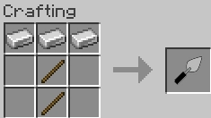 |
| Copy-Paste Trowel | 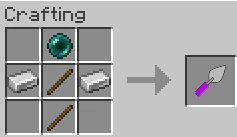 |
| Undo Trowel | 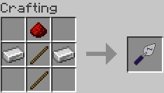 |
| Fire Trowel | 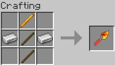 |

### Random Variants
Craft any base trowel + Amethyst Shard → Random version

### Fluid Tools

| Tool | Recipe |
|------|--------|
| Water Fill Ladle | 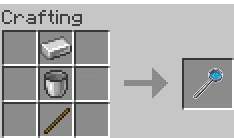 |
| Lava Fill Ladle | 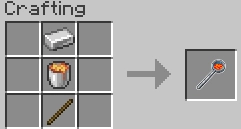 |
| Drain Ladle | 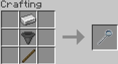 |
| Sponge Mop | 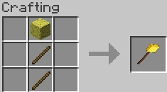 |
| Water Hose | 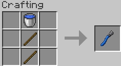 |
| Lava Hose | 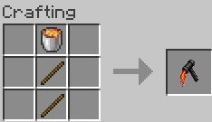 |

---

## Controls

- **G** (default) – Open Cube Digger options while holding the digger
- Most tools use **right-click** (and sneak for alternate modes)
- Two-point selection tools: right-click once to set point A, again to set point B

---

## Installation

1. Install **Minecraft 1.21.11**
2. Install **Forge 61.x**
3. Place the mod jar in your `mods` folder

---

## Credits

- Original concept inspired by **Torojima**’s Buildhelper mod
- Developed by **Emmery Chrisco**

---

## Links

- [CurseForge](https://www.curseforge.com/minecraft/mc-mods/trowel-and-error)
- [Modrinth](https://modrinth.com/mod/trowel-and-error)
- Issues & suggestions: use the GitHub Issues tab

---

*Built with love, spite, and an unreasonable tolerance for API refactors.*
